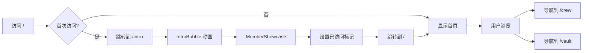

# 路由架构说明

## 概述
项目已从单页面应用重构为多页面路由架构（Next.js App Router），实现页面解耦和性能优化。

## 目录结构

```
src/
├── app/
│   ├── (home)/              # 路由组：首页（路径：/）
│   │   └── page.tsx         # 主页面：Hero + Timeline + Gallery + Anecdotes
│   ├── intro/               # Intro 页面（路径：/intro）
│   │   └── page.tsx         # 介绍动画和成员展示
│   ├── crew/                # 成员页面（路径：/crew）
│   │   └── page.tsx         # 团队成员展示
│   ├── vault/               # 寄意页面（路径：/vault）
│   │   └── page.tsx         # 未来信件（使用 dynamic import 优化）
│   ├── layout.tsx           # 根布局：字体、全局组件
│   └── globals.css          # 全局样式
│
├── components/
│   ├── ui/                  # 通用 UI 组件
│   │   ├── Navigation.tsx   # 导航栏组件
│   │   ├── LoadingScreen.tsx # 加载屏幕
│   │   ├── MusicPlayer.tsx  # 背景音乐播放器
│   │   ├── CustomCursor.tsx # 自定义光标
│   │   └── Noise.tsx        # 背景噪点效果
│   ├── providers/           # Context Providers
│   │   └── AppProvider.tsx  # 应用全局状态管理
│   ├── SmoothScroll.tsx     # 平滑滚动包装器
│   └── [其他页面组件]/      # 各页面专用组件
```

## 路由设计

### 1. 首页 `/` 
- **文件**: `src/app/(home)/page.tsx`
- **功能**: 
  - 检测首次访问，自动跳转到 `/intro`
  - 已访问用户直接显示主内容
  - 包含：Hero、Timeline、Gallery、Anecdotes
- **特点**: 使用路由组 `(home)` 避免 URL 中出现 home 路径

### 2. Intro 页面 `/intro`
- **文件**: `src/app/intro/page.tsx`
- **功能**:
  - 显示欢迎动画（IntroBubble）
  - 成员展示动画（MemberShowcase）
  - 完成后设置 localStorage 标记并跳转到首页
  - 启动背景音乐

### 3. 成员页面 `/crew`
- **文件**: `src/app/crew/page.tsx`
- **功能**: 展示所有团队成员卡片
- **优化**: 独立的 ScrollTrigger 管理，页面卸载时清理

### 4. 寄意页面 `/vault`
- **文件**: `src/app/vault/page.tsx`
- **功能**: 展示未来信件
- **优化**: 
  - 使用 `dynamic import` 异步加载组件
  - 自定义 loading 状态
  - 禁用 SSR (`ssr: false`)
  - 独立的 ScrollTrigger 管理

## 性能优化

### 1. Dynamic Import
```tsx
// vault/page.tsx
const FutureLetter = dynamic(() => import('@/components/future/FutureLetter'), {
  loading: () => <LoadingScreen />,
  ssr: false,
})
```
- 减少首屏 JavaScript 体积
- 按需加载大型组件（3D、动画）
- 自定义加载状态提升用户体验

### 2. ScrollTrigger 独立性
```tsx
// 每个页面的清理逻辑
useEffect(() => {
  return () => {
    ScrollTrigger.getAll().forEach(trigger => trigger.kill())
  }
}, [])
```
- 路由切换时自动清理 ScrollTrigger
- 避免跨页面干扰
- SmoothScroll 监听路由变化，统一清理

### 3. 路由组优化
- 使用 `(home)` 路由组让首页路径为 `/` 而非 `/home`
- 保持 URL 简洁美观

## 全局组件管理

### AppProvider
- **位置**: `src/components/providers/AppProvider.tsx`
- **功能**: 
  - 管理音乐播放器引用
  - 提供全局 Context
  - 在 intro 页面和其他页面间共享音乐播放器状态

### Navigation
- **位置**: `src/components/ui/Navigation.tsx`
- **功能**:
  - 固定顶部导航栏
  - 高亮当前页面
  - 在 intro 页面自动隐藏

### SmoothScroll
- **位置**: `src/components/SmoothScroll.tsx`
- **功能**:
  - 使用 Lenis 提供平滑滚动
  - 与 GSAP ScrollTrigger 同步
  - 监听路由变化，自动清理和重新初始化

## 用户流程



## 首次访问检测

```tsx
// (home)/page.tsx
useEffect(() => {
  const hasVisited = localStorage.getItem('hasVisitedIntro')
  if (!hasVisited) {
    router.push('/intro')
  }
}, [])

// intro/page.tsx
const handleIntroComplete = () => {
  localStorage.setItem('hasVisitedIntro', 'true')
  router.push('/')
}
```

## 开发和测试

### 清除首次访问标记
在浏览器控制台运行：
```javascript
localStorage.removeItem('hasVisitedIntro')
```
刷新页面即可重新体验 intro 流程。

### 测试路由切换
1. 访问 `/` - 应看到首页或跳转到 intro
2. 访问 `/crew` - 应看到成员页面
3. 访问 `/vault` - 应看到加载动画后显示寄意页面
4. 使用导航栏在页面间切换

### 性能测试
1. 检查 Network 面板，vault 页面应延迟加载
2. 检查 Console，确保没有 ScrollTrigger 警告
3. 切换路由时观察内存使用，确保组件正确卸载

## 迁移说明

### 已移除的文件
- `src/app/page.tsx` - 被 `(home)/page.tsx` 替代
- `src/components/AppWrapper.tsx` - 功能被 `AppProvider` 和独立路由替代

### 新增的文件
- `src/app/(home)/page.tsx` - 首页
- `src/app/intro/page.tsx` - Intro 页面
- `src/app/crew/page.tsx` - 成员页面
- `src/app/vault/page.tsx` - 寄意页面
- `src/components/ui/Navigation.tsx` - 导航组件
- `src/components/ui/LoadingScreen.tsx` - 加载屏幕
- `src/components/providers/AppProvider.tsx` - 全局状态

## 未来扩展

### 添加新页面
1. 在 `src/app/` 下创建新文件夹
2. 添加 `page.tsx`
3. 在 `Navigation.tsx` 中添加导航项
4. 如需优化，使用 dynamic import

### 添加共享布局
可在路由组或单独路由中添加 `layout.tsx` 文件，实现局部布局共享。

### 预加载优化
使用 Next.js 的 `<Link prefetch>` 或路由预加载 API 进一步优化导航体验。

## 技术栈
- **框架**: Next.js 16.1 (App Router)
- **动画**: Framer Motion, GSAP
- **滚动**: Lenis
- **样式**: Tailwind CSS
- **3D**: React Three Fiber (vault 页面)
